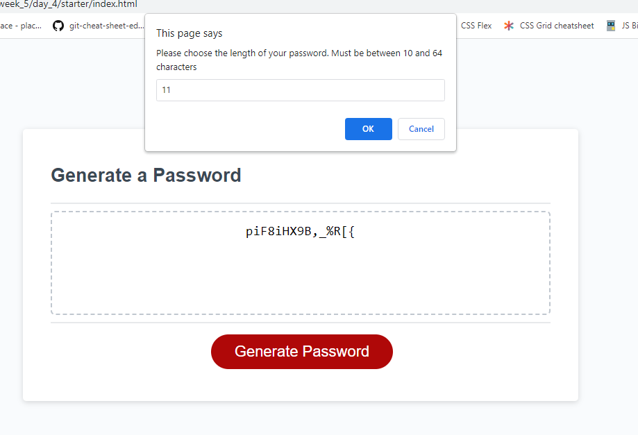
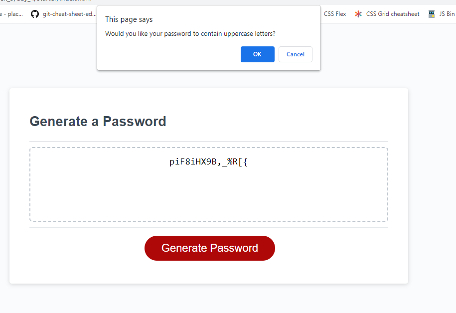
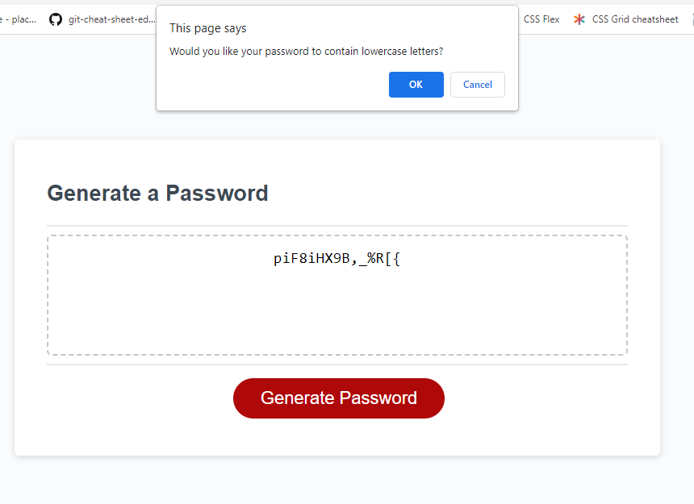
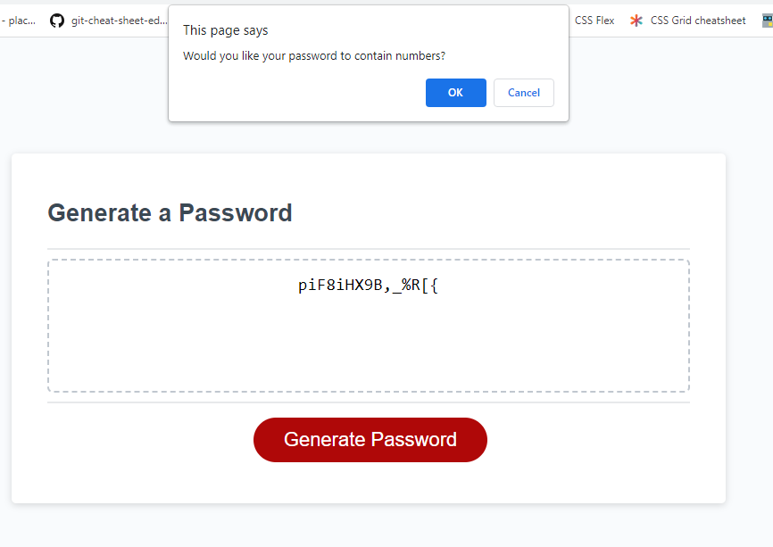
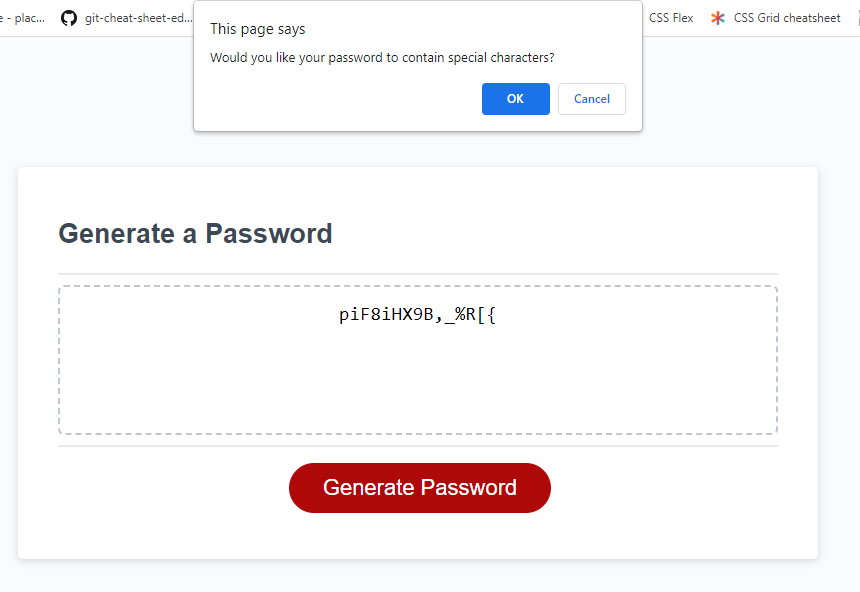
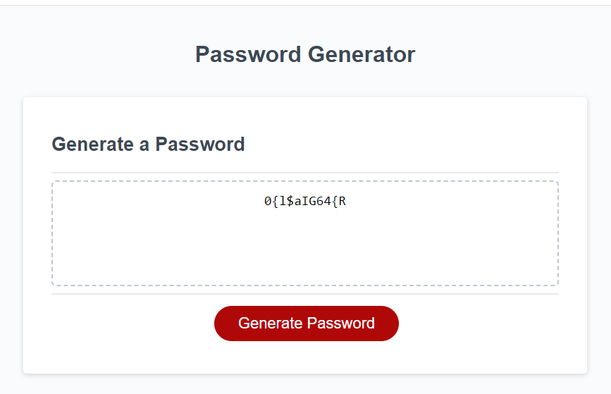
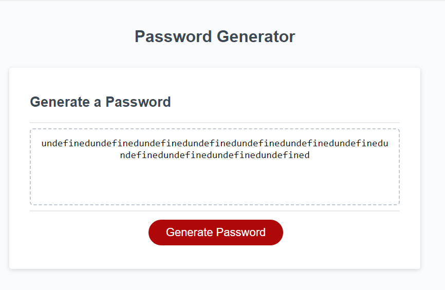

# password-generator

## Description

### The Task

I was tasked with creating a random password generator. The requirements are listed below and whilst there are still a few minor bugs I feel this meets the requirements at this stage. 

### Known Bugs

If a user presses cancel for all character types the password returns a list of undefined text, which is not ideal but will be fixed in a future release. As the requirements state at least one character "should" be selected and not "must" be selected, the minimum requirements are met.

## The requirements

* Generate a password when the button is clicked
  * Present a series of prompts for password criteria
    * Length of password
      * At least 10 characters but no more than 64.
    * Character types
      * Lowercase
      * Uppercase
      * Numeric
      * Special characters ($@%&*, etc)
  * Code should validate for each input and at least one character type should be selected
  * Once prompts are answered then the password should be generated and displayed in an alert or written to the page

## Usage

To access the website, navigate to [my password generator](https://darrenoxley7.github.io/password-generator). Click Generate Password then follow the browser prompts.

This final image shows the current output if users select "Cancel" for all selections

## Installation

To view the code navigate to the website using the link above and right click on any website element and cick inspect or download the source code from [My GitHub repo](https://github.com/DarrenOxley7/password-generator.git) and open the index.html and script.js file in VS Code.

## Credits

### Resources:

MIT License

Copyright (c) 2022 DarrenOxley7

Permission is hereby granted, free of charge, to any person obtaining a copy
of this software and associated documentation files (the "Software"), to deal
in the Software without restriction, including without limitation the rights
to use, copy, modify, merge, publish, distribute, sublicense, and/or sell
copies of the Software, and to permit persons to whom the Software is
furnished to do so, subject to the following conditions:

The above copyright notice and this permission notice shall be included in all
copies or substantial portions of the Software.

THE SOFTWARE IS PROVIDED "AS IS", WITHOUT WARRANTY OF ANY KIND, EXPRESS OR
IMPLIED, INCLUDING BUT NOT LIMITED TO THE WARRANTIES OF MERCHANTABILITY,
FITNESS FOR A PARTICULAR PURPOSE AND NONINFRINGEMENT. IN NO EVENT SHALL THE
AUTHORS OR COPYRIGHT HOLDERS BE LIABLE FOR ANY CLAIM, DAMAGES OR OTHER
LIABILITY, WHETHER IN AN ACTION OF CONTRACT, TORT OR OTHERWISE, ARISING FROM,
OUT OF OR IN CONNECTION WITH THE SOFTWARE OR THE USE OR OTHER DEALINGS IN THE
SOFTWARE.